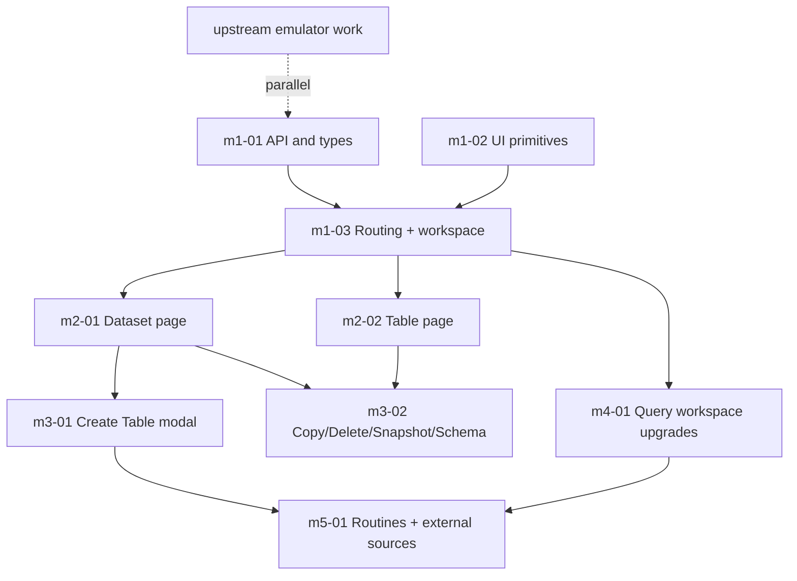

# BigQuery Console UI — Phase Index

Source roadmap: [`ROADMAP.md`](../../ROADMAP.md).

Goal: evolve the single-page explorer into a BigQuery web console–style UI (breadcrumbs, resource detail pages with tabs, action toolbars, multi-tab query workspace, create/copy/snapshot/delete modals, saved queries, routines). Every feature is built to the real BigQuery REST contract; emulator gaps are tracked upstream, not descoped.

## Plan files

| Phase | Plan file | Depends on |
|-------|-----------|------------|
| M1 | [`m1-01-api-and-types.plan.md`](m1-01-api-and-types.plan.md) | — |
| M1 | [`m1-02-ui-primitives.plan.md`](m1-02-ui-primitives.plan.md) | — |
| M1 | [`m1-03-routing-workspace-breadcrumbs.plan.md`](m1-03-routing-workspace-breadcrumbs.plan.md) | m1-01, m1-02 |
| M2 | [`m2-01-dataset-detail-page.plan.md`](m2-01-dataset-detail-page.plan.md) | m1-* |
| M2 | [`m2-02-table-detail-page.plan.md`](m2-02-table-detail-page.plan.md) | m1-* |
| M3 | [`m3-01-create-table-modal.plan.md`](m3-01-create-table-modal.plan.md) | m1-*, m2-01 |
| M3 | [`m3-02-copy-delete-snapshot-schema.plan.md`](m3-02-copy-delete-snapshot-schema.plan.md) | m1-*, m2-* |
| M4 | [`m4-01-query-workspace-upgrades.plan.md`](m4-01-query-workspace-upgrades.plan.md) | m1-* |
| M5 | [`m5-01-routines-and-external-sources.plan.md`](m5-01-routines-and-external-sources.plan.md) | m2-01, m3-01, m4-01 |
| Parallel | [`upstream-emulator-work.plan.md`](upstream-emulator-work.plan.md) | — |

## Execution order

## Conventions for every sub-plan

- Build to the real BigQuery REST contract. If the emulator lacks a behavior, add an entry to [`upstream-emulator-work.plan.md`](upstream-emulator-work.plan.md) and degrade gracefully (placeholder/error state) rather than removing the UI control.
- Keep existing functionality working: Run query, Format SQL, Results/JSON tabs, sidebar tree, share URL.
- Verification baseline for UI-only phases: `npm run build` (typecheck + bundle) and `npm run lint` must pass; add/adjust Playwright specs under `e2e/` where a flow is user-visible.
- Follow the repo auto-commit rule: commit each logical unit with conventional-commit messages.

## Out of scope (all plans) — Unplanned tabs

Render an **Unplanned** placeholder, do not implement: dataset Insights, Overview Graphs, Overview Models; table/view Table Explorer, Insights, Lineage, Data Profile, Data Quality.
