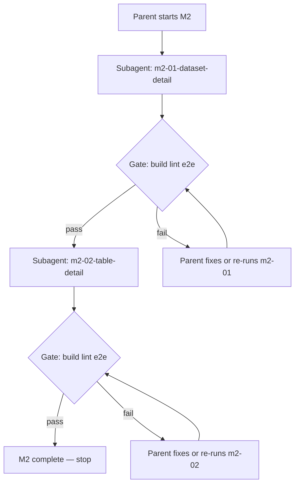

# M2 Sequential Subagent Orchestration

Source index: [`.cursor/plans/00-index.plan.md`](00-index.plan.md). **M1 is complete** (m1-01/02/03 all `completed`). Scope is **M2 only** — stop after m2-02; do not execute M3 plans.

## Role split

| Role | Responsibility |
|------|----------------|
| **Parent** | Launch one subagent at a time (`run_in_background: false`), run verification gates, update index todos, only then launch the next |
| **Subagent** | Implement exactly one plan file, auto-commit logical units, report done criteria + blockers |



## Why sequential (not parallel)

The index allows m2-01 and m2-02 to depend only on M1, but **sequential execution is intentional**:

1. **m2-01 Overview → Tables links** must navigate to table routes that m2-02 fully implements (today `TableTabPage.tsx` is still a placeholder).
2. **E2E evolution** — m2-01 adds dataset flows; m2-02 extends table flows without racing on `e2e/explorer.spec.ts`.
3. **Shared resource module** — both phases land under `src/features/resource/`; serial commits avoid merge conflicts.

## Subagent invocation rules

Use the **Task** tool with:

- `subagent_type`: `generalPurpose`
- `run_in_background`: **`false`**
- One subagent per plan file

Each prompt must include:

1. Plan path under `.cursor/plans/`
2. Repo root: `/home/brighten-tompkins/Code/bigquery-emulator-ui`
3. Auto-commit with conventional commits; never `git add .`
4. Scope guards (see per-phase below)
5. Return format: commits, files changed, verification summary, blockers, upstream gaps

---

## Starting point (post-M1)

| File | Current state |
|------|---------------|
| `src/features/resource/DatasetTabPage.tsx` | Breadcrumbs + "coming in M2" placeholder |
| `src/features/resource/TableTabPage.tsx` | Breadcrumbs + placeholder + standalone Query button |
| `src/features/workspace/components/ResourceSidebar.tsx` | Dataset click **only expands** tree; does not open dataset tab |
| `src/features/workspace/store.tsx` | `openDatasetTab`, `openQueryForTable` already exist |
| M1 API | `datasetMetadata`, `routines`, `tables`, `tableSchema`, `tableData` in `explorerQueries` |
| M1 UI | Primitives in `src/components/ui/` |

---

## Phase 1 — m2-01-dataset-detail-page (blocking)

**Plan**: [`.cursor/plans/m2-01-dataset-detail-page.plan.md`](m2-01-dataset-detail-page.plan.md)

**Subagent implements**:

### Replace placeholder with full dataset page

- Enhance or split `DatasetTabPage.tsx` into a `DatasetPage` shell with:
  - `Breadcrumbs` via existing `datasetBreadcrumbs`
  - `ActionToolbar` + `ToolbarButton`: **Create Table**, **Copy**, **Delete**, **Refresh**
  - Resource tab bar (`Tabs`/`TabBar`): **Overview**, **Details**, **Insights**

### Overview tab (sub-tabs)

- **Tables** (live): list via `explorerQueries.tables`; columns Table ID, Type, Created; rows link to `/project/:p/dataset/:d/table/:t`
- **Routines** (live-lite): list via `explorerQueries.routines`; graceful empty/error if unsupported (log upstream)
- **Graphs**, **Models**: `UnplannedTab`

### Details tab

- `DetailTable` + `SectionHeading` ("Dataset info") from `explorerQueries.datasetMetadata`
- Render **all** fields from plan even when null → `—` (do not hide rows)

### Insights tab

- `UnplannedTab`

### Toolbar stubs (M3 prep)

- Create Table / Copy / Delete open stub modal or visible no-op with TODO referencing M3 — buttons stay enabled

### Sidebar integration (explicit — not optional)

Wire dataset click in `ResourceSidebar.tsx` to `openDatasetTab` + navigate to dataset route (per ROADMAP: "clicking a dataset opens a resource tab"). Preserve expand/collapse behavior (e.g. chevron toggles expand, name click opens tab, or equivalent UX).

### E2E

Add/adjust `e2e/explorer.spec.ts`:

- Open dataset from sidebar → Overview visible
- Details tab shows dataset info fields
- Insights shows Unplanned placeholder

**Out of scope**: Create/Copy/Delete modal bodies, job submission (M3); routine detail (M5)

**Parent verification gate**:

```bash
npm run build && npm run lint && npm run e2e:up && npm run test:e2e && npm run e2e:down
```

**Index update**: mark `m2-01` `completed` in `00-index.plan.md`.

---

## Phase 2 — m2-02-table-detail-page (blocking, after m2-01 gate)

**Plan**: [`.cursor/plans/m2-02-table-detail-page.plan.md`](m2-02-table-detail-page.plan.md)

**Subagent implements**:

### Replace placeholder with full table/view page

Replace/enhance `TableTabPage.tsx`:

- `Breadcrumbs` via `tableBreadcrumbs`
- `ActionToolbar`: **Query**, **Copy**, **Snapshot** (tables only), **Delete**, **Refresh**
- Tab bar: Schema, Details, Preview, Table Explorer, Insights, Lineage, Data Profile, Data Quality
- Branch UI on `resourceType` from `explorerQueries.tableSchema` / metadata

### Schema tab (read-only)

- Field grid with filter, row selection, Copy dropdown (Copy as Table / Copy as JSON)
- Edit schema + View row access policies buttons present; Edit schema disabled/stubbed (M3-02)

### Details tab

- Conditional "Table info" / "View info" `DetailTable`
- "Storage info" (empty + note for views/MV)
- "Query" section for views/MV (read-only SQL; Edit Query stubbed for M4)

### Preview tab

- Paginated `explorerQueries.tableData`; fallback to `SELECT * FROM fqn LIMIT n` via `runQuery` if unsupported

### Query button

- Move from inline button to toolbar; use `openQueryForTable` / workspace store with `SELECT * FROM \`project.dataset.table\` LIMIT 1000` (align `defaultSql` in `types.ts` or local helper to plan spec)

### Unplanned tabs

- Table Explorer, Insights, Lineage, Data Profile, Data Quality → `UnplannedTab`

### E2E

Extend `e2e/explorer.spec.ts`:

- Schema tab lists fields; Copy as JSON works
- Details shows info + storage
- Preview paginates (or shows fallback note)
- Query opens new persisted query tab
- Update existing tests that target `open-query-from-table` testId if toolbar moves it

**Out of scope**: Schema editing, Copy/Snapshot/Delete modals + jobs (M3); Edit Query (M4)

**Parent verification gate**:

```bash
npm run build && npm run lint && npm run test && npm run e2e:up && npm run test:e2e && npm run e2e:down
```

Note: include `npm run test` here because m2-02 may add unit tests for schema copy helpers or preview fallback logic.

**Index update**: mark `m2-02` `completed`. **Stop** — leave m3-01+ `pending`.

---

## Failure handling (parent)

1. Read subagent output + failing command output
2. Fix directly or `resume` the subagent scoped to the failure
3. Re-run gate; do not start m2-02 until m2-01 is green

Emulator gaps → update `.cursor/plans/upstream-emulator-work.plan.md`; graceful UI degradation is required, not descoping.

---

## Subagent prompt templates

### Phase 1

> Read and fully implement `.cursor/plans/m2-01-dataset-detail-page.plan.md` in `/home/brighten-tompkins/Code/bigquery-emulator-ui`. Replace `DatasetTabPage` placeholder with full dataset page using M1 API + UI primitives. Wire sidebar dataset click to open dataset tab. Toolbar Create/Copy/Delete = stubs until M3. Add e2e for dataset Overview/Details/Insights. Auto-commit. Run `npm run build && npm run lint && npm run e2e:up && npm run test:e2e && npm run e2e:down`. Return: commits, files, e2e summary, blockers.

### Phase 2

> Read and fully implement `.cursor/plans/m2-02-table-detail-page.plan.md`. Replace `TableTabPage` placeholder with full table/view page; branch on `resourceType`. Schema/Details/Preview live; unplanned tabs = placeholders. Query toolbar opens persisted query tab with LIMIT 1000. Update e2e for schema/details/preview/query; fix tests broken by toolbar move. No M3 modals. Auto-commit. Run build, lint, test, e2e stack. Return: commits, route/tab map, e2e summary, blockers.

---

## Expected outcome after M2

- Dataset route: Overview (Tables/Routines live, Graphs/Models unplanned), Details (full metadata), Insights unplanned, action toolbar with M3 stubs
- Table route: Schema, Details, Preview live; conditional UI by resource type; Query opens workspace query tab
- Sidebar: dataset click opens dataset tab; table click opens table tab (existing)
- All verification green; index shows m2-01/02 completed, M3+ still pending
